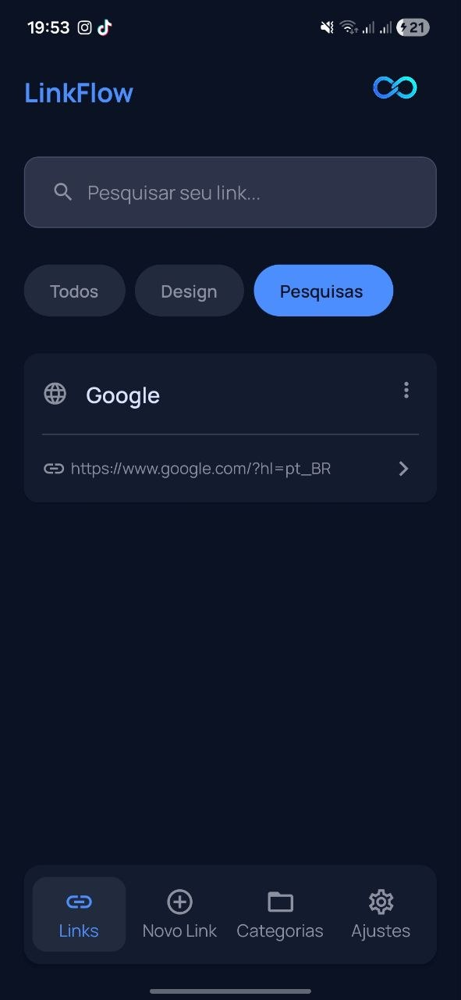
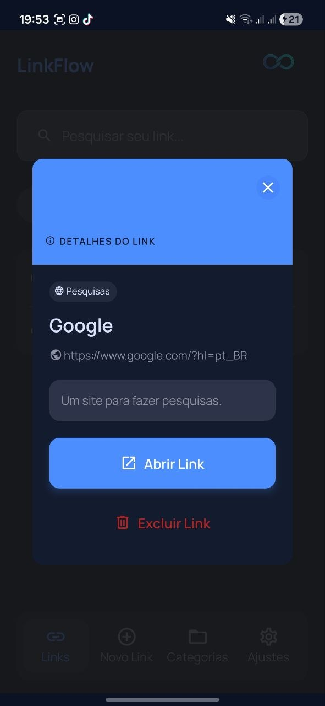
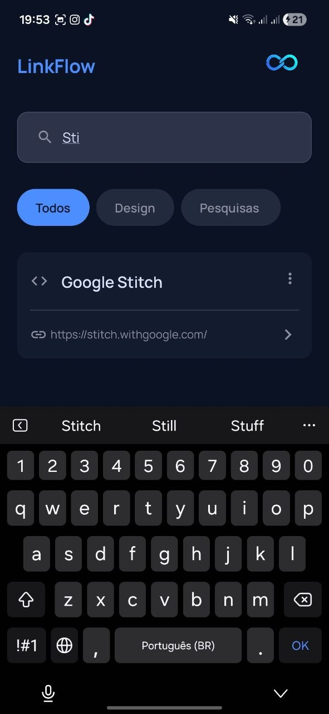

# LinkFlow

Um aplicativo mobile para organizar e gerenciar seus links de forma simples e eficiente.
Com ele, você pode criar categorias, salvar links e manter tudo organizado em um só lugar.

---

## Funcionalidades

* Busca de links em tempo real
* Criação e gerenciamento de categorias
* Cadastro de links personalizados
* Validação para impedir exclusão de categorias com links vinculados
* Tema claro e escuro com persistência
* Autenticação com Google

---

## Demonstração

<p align="center">
  
</p>

---

## Screenshots

<p align="center">
  
  
  
</p>

---

## Tecnologias

Esse projeto foi desenvolvido com as seguintes tecnologias:

* React Native
* Expo
* TypeScript

---

## Bibliotecas principais

* Firebase (Firestore + Auth)
* Google Sign-In
* AsyncStorage
* Expo Router
* React Native Toast Message

---

## Download do APK

Você pode baixar e testar o aplicativo através do link abaixo:

👉 [Download APK](https://github.com/AlexKerner/linkflow/releases/tag/v1.0.0)

---

## Como rodar o projeto

```bash
# Clonar repositório
git clone https://github.com/AlexKerner/linkflow.git

# Entrar na pasta
cd linkflow

# Instalar dependências
npm install

# Rodar o projeto
npx expo start
```

---

## Build do APK

```bash
npx expo prebuild
eas build -p android --profile preview
```
